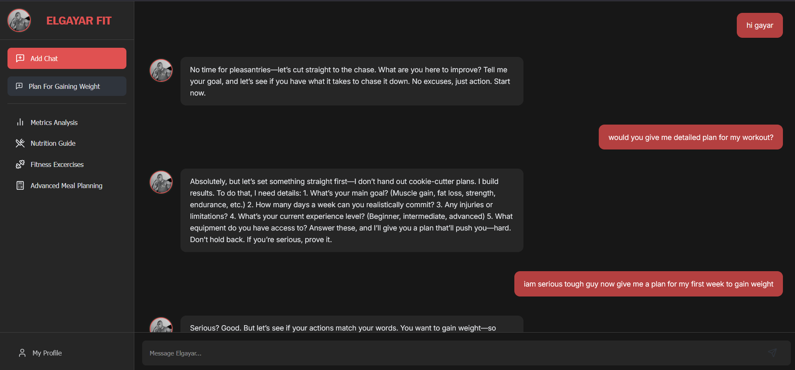
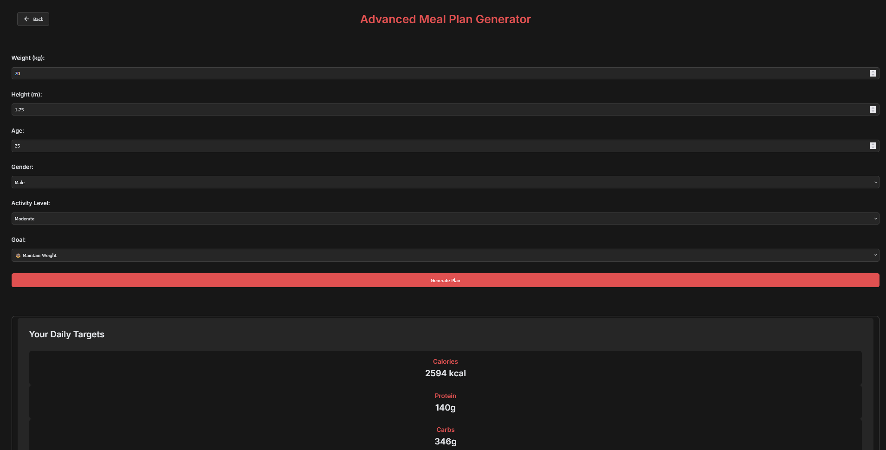
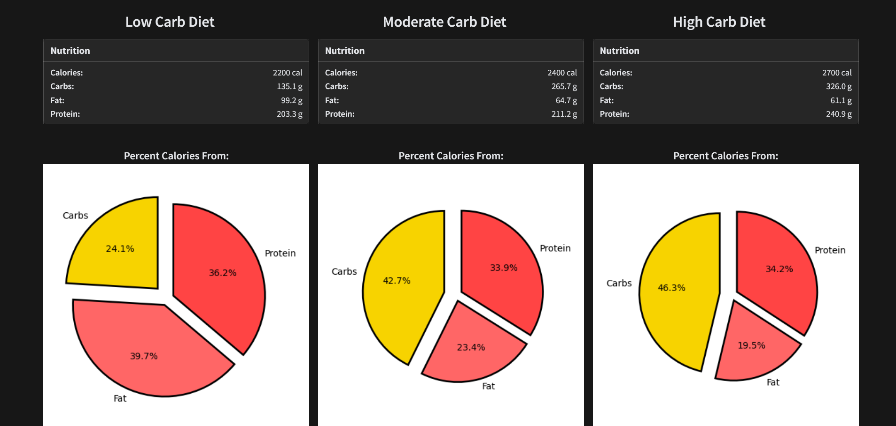
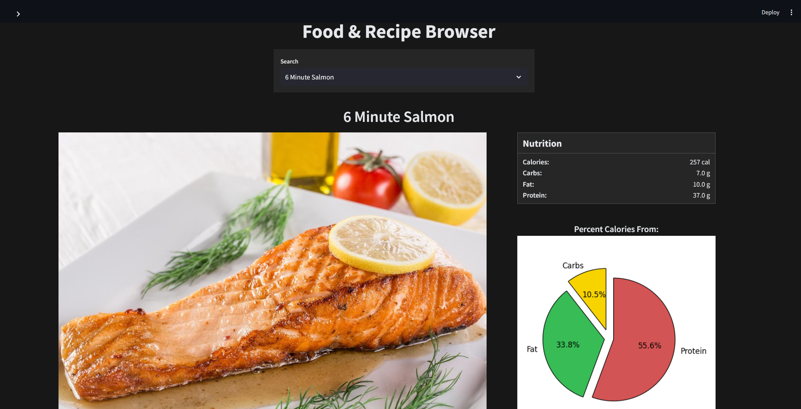
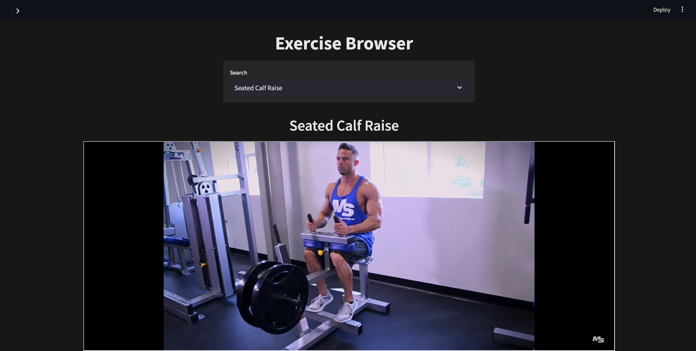

# ElgayarFit - Fitness Web Application

ElgayarFit is a personalized fitness coaching platform that combines AI-powered chat with dynamic health tools like nutrition guides, fitness exercises, and evolutionary algorithm-based optimizers (DE). It offers a user-friendly interface with engaging animations to help users train smarter and track progress effectively.



---

##  Features

- **AI Chat Coach**: Ask questions and receive training guidance using OpenAI-powered chat.
- **DE Optimizer**: Use the Differential Evolution (DE) algorithm for intelligent fitness or nutrition-based optimization.
- **Metrics Dashboard**: Analyze performance metrics using an integrated Streamlit app.
- **Nutrition Guide**: Get healthy meal recommendations tailored to your goals.
- **Fitness Exercises**: Discover various workouts and fitness routines.
- **Modern UI**: Inspired by WhatsApp chat aesthetics with real-time interaction and animations.

---

## Screenshots of whole application

| Home / Chat | DE Algorithm | Metrics Dashboard | Nutrition Guide | Fitness Exercises |
|-------------|--------------|-------------------|------------------|-------------------|
|  |  |  |  |  |

---

## Installation & Setup Guide

> Make sure you have **Node.js (v18+)** and **npm** installed.

### 1. Clone the repository

```bash
git clone https://github.com/binghazy/ElgayarFit-Fitness-Web-Application.git
cd ElgayarFit-Fitness-Web-Application
```
### 2. Install dependencies
```bash
npm install
```
### 3. Start the development server
```bash
npm run dev
```
### 4. Run the backend (Streamlit)

Make sure Streamlit is installed in your Python environment:
```
pip install streamlit
```
Then run the Streamlit app:
```
streamlit run backend/app.py
```
## 📄 License

This project is licensed under the [MIT License](https://github.com/binghazy/ElgayarFit-Fitness-Web-Application/blob/main/LICENSE).
I do not mind if you used it, but at least mention me then 😘

---

Built with ❤️ by [Binghazy](https://github.com/binghazy)
with contributions of :
<br>
--> [Mwg7x](https://github.com/mwg7x)
<br>
--> [Tarto2a](https://github.com/tarto2a)
<br>
--> [Ayah](https://github.com/Ayah-hub2004)

